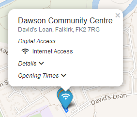

# Application Configuration and Setup

The configuration for this project is split between an application config, that controls the map options and what
data to include, and individual 'map theme' definitions.   The map themes describe the type of data to load from 
OSM via the Overpass API.


## App Config
The configuration for the app is stored in the file src/themes/config.js

Within this config file the appConfig object provides a convenient way to customise the application text. 

```javascript
const appConfig = {
    Title: "Our Falkirk",
    SubTitle: "Local Support Services",
    Info: "An example application using OpenSteetMap and Leaflet"
};

```

The Title and SubTitle descriptions are used by the application navbar and information modal.   For more control over the 
HTML markup and formatting, the textual components can be updated in the corresponding React components themselves, found 
in the src/components folder. 

## Map Config
The mapConfig object sets the configuration options for leaflet. 

Here, there are options to set the map centre when the application loads, the initial zoom level and the map bounds. 
The most important options here set the map centre and bounds:
```javascript
center: [56.0019, -3.789]
maxBounds: ([[55.7, -4.3], [56.3, -3.1]]) 
```

For more information see the leaflet [documentation](https://leafletjs.com/reference-1.4.0.html#map-factory) 

The tileLayer options sets the source of the background map tiles.  The default tileserver we are using is from 
[wikimedia](https://maps.wikimedia.org).  The application is agnostic to the tileLayer used - there are a number 
of different options here, including the OSM project or commercial services provided by organisations such as 
[MapBox](https://www.mapbox.com/). * Note for commercial services ensure the 'accessToken' option has been completed.

`accessToken: ''` - my access token goes here

The 'appThemes' list specifies what map themes the application will load.   These themes are defined in separate files
within the src/themes folder.  The theme files must be included in the import statement for the config.js file 
before they can be referenced in the appThemes list. (see the example usage below.)

`import { example } from "./themes/example"`

`...`

`const appThemes = [example];`


## Defining Map Themes

Map themes are stored as separate JavaScipt files, that reside in the src/themes folder. 

An example theme is listed in src/themes/example.js

The theme object is a Javascript object specifying the name, title, description and the OpenStreetMap OverPass query 
used to query the data on the OpenStreetMap servers. 

The different options for the theme definition, and how the different options are used by the application 
are described below: 

| Option      | Description           | Usage |
| ------------- |:-------------| :-----|
| Name     | The name of the theme | Used internally by the application to reference the theme |
| Title      | The prettified name of the theme      |   Used by the application sidebar to display the theme |
| Description      | Desribes the purpose of the theme    |   Used by the Map Themes popup to display theme information |
| AttributeTags  |  Describes the feature attributes of interest | Used by a popup of feature information    |
|  overPassQuery   | Defines the query used by the Overpass API    | Used to extract data from OpenSteetMap    |
| mapConfig  | Defines the font-awesome-icon and colour    | Used by leaflet as the feature marker     |


Example theme:

```javascript

const school = {
    Name: "schools",
    Title: "Example theme - Schools",
    Description: "An example OpenStreetMap theme, showing the location of schools.",
    Author: "Martin Clarke",
    AttributeTags: [],
    overpassQuery: `[out:json];\
        (way["amenity"~"(school)$"](around:5000,56.0019,-3.7893);\
        relation["amenity"~"(school)$"](around:5000,56.0019,-3.7893);\
        node["amenity"~"(school)$"](around:5000,56.0019,-3.7893););\
        out body;>;out skel qt;`,
    mapConfig: {
         mapIcon: "school",
         color: "blue"
    }
};

export {
    school
};

```

Example theme 2 - A more complicated theme example, with a defined list of AttributeTags

```javascript

let digiAccess = {
    Name: "digitalAccess",
    Title: "Digital Access",
    Headline: "Shows locations of places that provides access to digital Services",
    Description: "This theme shows locations that provide access to digital services.  These include access to " +
    "printing facilities, access to computers for public use and Wifi / internet access",
    Author: "MartinClarke",
    OSMFeatures: ["ways", "nodes"],
    GeoTags: {
        "amenity": ["library", "community_centre"]
    },
    AttributeTags: [
         {  attributeName: "Internet Access",
            attributeTag: "internet_access",
            attributeValues: ["wlan", "yes", "terminal", "wifi", "service"],
            icon: "wifi"
        },
        {   attributeName: "Printing Facilities",
            attributeTag: "digital_access",
            attributeValues: ["printer"],
            icon: "print"
        },
        {   attributeName: "Computer Access",
            attributeTag: "digital_access",
            attributeValues: ["computer"],
            icon: "desktop"
        },
        {   attributeName: "Membership Required",
            attributeTag: "digital_access:membership",
            attributeValues: ["yes"],
            icon: "exclamation",
            iconColor: "red"
        },

    ],
    overpassQuery: `[out:json];\
        (way["amenity"~"(library|community_centre)$"][~"^(internet_access|digital_access)$"~"."](around:20000,56.0019,-3.7893);\
        node["amenity"~"(library|community_centre)$"][~"^(internet_access|digital_access)$"~"."](around:20000,56.0019,-3.7893););\
        out body;>;out skel qt;`,
    mapConfig: {
         mapIcon: "wifi",
         color: "blue"
    }
    };

```

## More on AttributeTags

The attributeTags definition for a theme describes the feature attributes of interest and how these attributes map to 
OpenStreetMap tags. This allows control over what type of information to display in a feature information popup, in addition
to the default address details and opening times.

In the example listed below, the attribue "Internet Access" maps to the "internet_access" OSM tag.
If a feature has the internet_access tag and the tag value is in the list of expected values given by the 'attributesValues'
list, the popup for the feature will display "Internet Access" alongside the associated font-awesome icon ("wifi").  

```javascript
AttributeTags: [
         {  attributeName: "Internet Access",
            attributeTag: "internet_access",
            attributeValues: ["wlan", "yes", "terminal", "wifi", "service"],
            icon: "wifi"
        }
     ]
```



For more information on OSM tags and usage see [taginfo](https://taginfo.openstreetmap.org/)

## More on Overpass Queries

The query defined in the theme config is in OverPass QL format.   This query language allows for a wide variety of 
query definitions. A comprehensive overview is given on this [OSM wiki](https://wiki.openstreetmap.org/wiki/Overpass_API/Overpass_QL)

